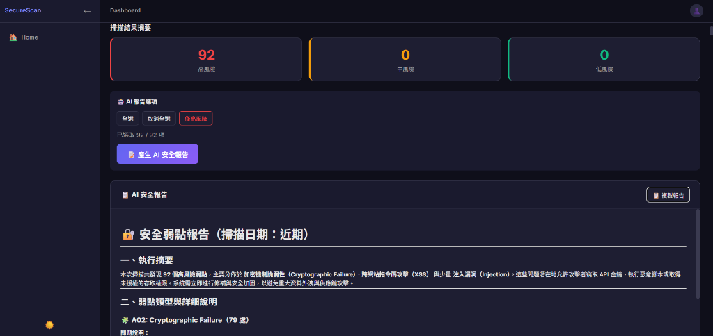

# SecureScan 🔒

AI-Powered 程式碼安全掃描器，基於 OWASP Top 10 檢測常見安全漏洞。



## ✨ Features

| 功能 | 說明 |
|------|------|
| 📁 **資料夾掃描** | 掃描整個專案，支援 .cs, .razor, .js, .ts |
| 🔍 **OWASP Top 10** | 偵測 SQL Injection, XSS, Hardcoded Secrets |
| 🤖 **AI 報告** | 一鍵產生 AI 安全分析報告 |
| 📊 **風險摘要** | 高/中/低風險統計與分組顯示 |
| 📥 **匯出功能** | 支援 Markdown / JSON 格式匯出 |

## 🚀 Quick Start

```powershell
cd SecureScan
dotnet run
```

1. 輸入專案路徑（或貼上程式碼）
2. 點擊「掃描資料夾」
3. 選擇風險項目
4. 點擊「產生 AI 安全報告」

## 🔧 AI 功能設定

複製 `appsettings.template.json` 為 `appsettings.json`，填入 Azure OpenAI 資訊：

```json
{
  "AzureOpenAI": {
    "Endpoint": "https://YOUR-RESOURCE.openai.azure.com/",
    "ApiKey": "YOUR-API-KEY",
    "DeploymentName": "gpt-4o"
  }
}
```

## 📂 Project Structure

```
SecureScan/
 ├── Components/Pages/     # Blazor 頁面
 ├── Services/             # 掃描引擎 & LLM 服務
 ├── wwwroot/              # 靜態資源
 └── appsettings.json      # 設定檔 (gitignored)
```

## 🛡️ 支援的安全檢測

| 規則 | 類型 | 描述 |
|------|------|------|
| A01 | Injection | SQL 拼接、命令注入 |
| A02 | Cryptographic Failure | 硬編碼密碼、API Key |
| A03 | XSS | Html.Raw、innerHTML |
| A07 | Weak Auth | 弱密碼規則 |

## 🪪 License

MIT License © 2026 breezy89757
